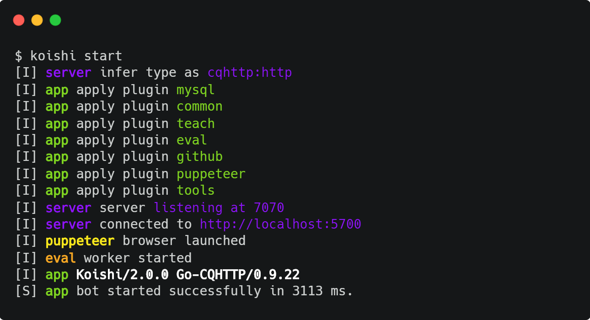
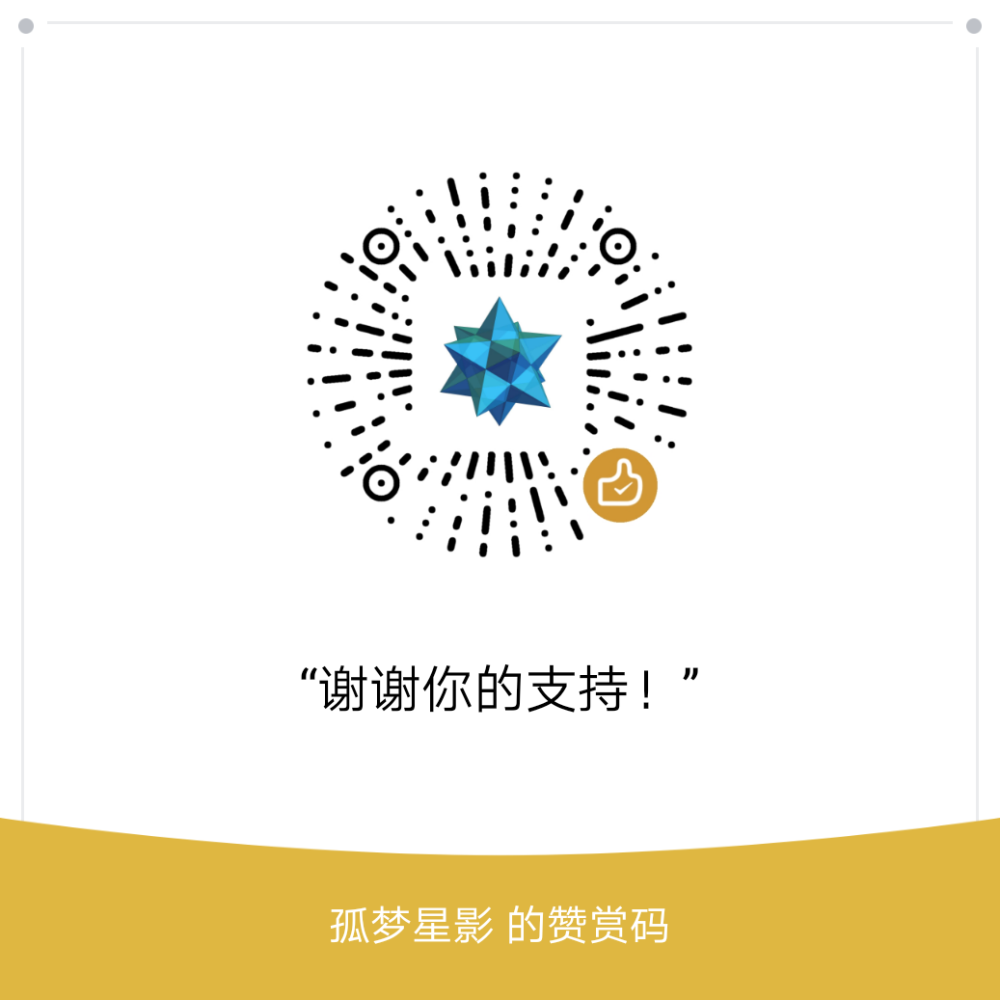

<div align="center">
  <a href="https://koishi.js.org/" target="_blank">
    
  </a>
  <h1 id="koishi"><a href="https://koishi.js.org/" target="_blank">Koishi</a></h1>

[](https://codecov.io/gh/koishijs/koishi)
[](https://lgtm.com/projects/g/koishijs/koishi/context:javascript)
[](https://www.npmjs.com/package/koishi)
[](https://github.com/koishijs/koishi/blob/master/LICENSE)

</div>

Koishi 是一个在 [Node.js](https://nodejs.org/) 环境下运行的机器人框架，目前支持 [CQHTTP (OneBot)](https://github.com/howmanybots/onebot) 协议，未来也将支持更多平台。

这个项目的名字和图标来源于东方 Project 中的角色古明地恋 (Komeiji Koishi)。



## 安装

```sh
# 进入文件夹
cd my-bot

# 安装 Koishi
npm i koishi

# 初始化配置文件
koishi init

# 运行你的 Bot
koishi run
```

现在可以对你的机器人说话了：

```sh
> echo hello world
< hello world
```

**注意:** Koishi 要求您的 Node.js 的版本不小于 12。

## 应用案例

| 项目地址 | <span align="center">简介</span> |
|:-:|:-:|
| [masnn/qqbot](https://github.com/masnn/qqbot) | 没想好（ |

欢迎[向上表中添加](https://github.com/koishijs/koishi/edit/master/README.md)自己的机器人。

## 平台支持

### [koishi-adapter-cqhttp](./packages/adapter-cqhttp) [](https://www.npmjs.com/package/koishi-adapter-cqhttp)

[CQHTTP (OneBot)](https://github.com/howmanybots/onebot) 协议支持，可与下列实现该协议的框架完美对接：

- [richardchien/coolq-http-api](https://github.com/richardchien/coolq-http-api)
- [Mrs4s/go-cqhttp](https://github.com/Mrs4s/go-cqhttp)
- [yyuueexxiinngg/cqhttp-mirai](https://github.com/yyuueexxiinngg/cqhttp-mirai)

## 数据库支持

### [koishi-plugin-mongo](./packages/plugin-mongo) [](https://www.npmjs.com/package/koishi-plugin-mongo)

MongoDB 支持。

### [koishi-plugin-mysql](./packages/plugin-mysql) [](https://www.npmjs.com/package/koishi-plugin-mysql)

MySQL 5.7 支持。

## 官方插件

### [koishi-plugin-chess](./packages/plugin-chess) [](https://www.npmjs.com/package/koishi-plugin-chess)

### [koishi-plugin-common](./packages/plugin-common) [](https://www.npmjs.com/package/koishi-plugin-common)

### [koishi-plugin-eval](./packages/plugin-eval) [](https://www.npmjs.com/package/koishi-plugin-eval)

### [koishi-plugin-eval-addons](./packages/plugin-eval-addons) [](https://www.npmjs.com/package/koishi-plugin-eval-addons)

### [koishi-plugin-github](./packages/plugin-github) [](https://www.npmjs.com/package/koishi-plugin-github)

### [koishi-plugin-image-search](./packages/plugin-image-search) [](https://www.npmjs.com/package/koishi-plugin-image-search)

### [koishi-plugin-monitor](./packages/plugin-monitor) [](https://www.npmjs.com/package/koishi-plugin-monitor)

### [koishi-plugin-puppeteer](./packages/plugin-puppeteer) [](https://www.npmjs.com/package/koishi-plugin-puppeteer)

### [koishi-plugin-recorder](./packages/plugin-recorder) [](https://www.npmjs.com/package/koishi-plugin-recorder)

### [koishi-plugin-rss](./packages/plugin-rss) [](https://www.npmjs.com/package/koishi-plugin-rss)

### [koishi-plugin-schedule](./packages/plugin-schedule) [](https://www.npmjs.com/package/koishi-plugin-schedule)

### [koishi-plugin-status](./packages/plugin-status) [](https://www.npmjs.com/package/koishi-plugin-status)

### [koishi-plugin-teach](./packages/plugin-teach) [](https://www.npmjs.com/package/koishi-plugin-teach)

### [koishi-plugin-tools](./packages/plugin-tools) [](https://www.npmjs.com/package/koishi-plugin-tools)

## 支持作者


